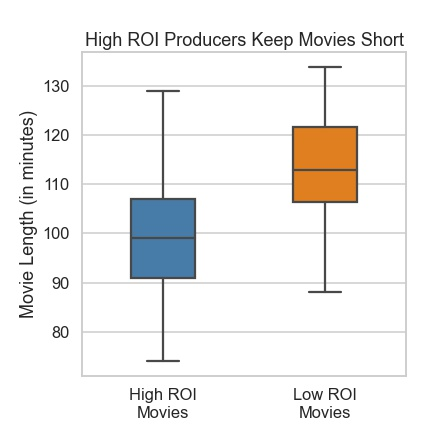
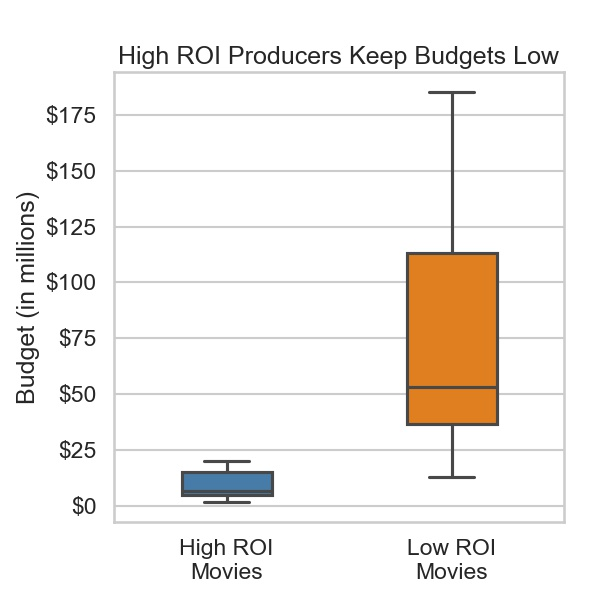
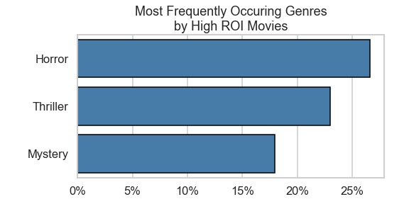

# Movie Analysis for Microsoft Studios
***

**Author:** Ronald Lodetti Jr.


## Overview
***
Microsoft would like to create a movie studio, but needs to better understand the movie landscape to help determine which kind of movies to produces. Analyzing trends of successful movie producers using data from The Numbers and IMDb shows patters with regards to movie length, production budget, and associated genres. Microsoft can use this information to improve decision-making when greenlighting movie projects. 


## Business Problem
***


As a new competitor in the field of movie production, Microsoft does not have a history to inform business decisions. They need analysis of current trends to help inform their first steps.


## Data
The data used in this project has come from <a href="https://www.the-numbers.com/">The Numbers</a> and <a href="https://www.imdb.com/">IMDb</a>. These data sets were compiled by The Flatiron School to be used in this project. 

The The Numbers dataset includes the finances a sampling of movies about 5700 movies ranging from 1915 to 2020. This dataset will be used to calculate the ROI for each movie.

The IMDb dataset comes from the IMDb database. This table was created by merging the movie_basics, persons, and principals tables, filtering the merged rows for persons whose job is a producer. 

This dataset includes information about over 67,000 movies and 64,000 producers ranging from 2010 to 2021. The genre dataset includes up to three genres associated with each movie from a list of 27 genres.

## Methods
***

This project uses descriptive analysis, including a comparison of two groups of movies to derive insights. 

I began with cleaning the the numbers and IMDb to be merged into one dataframe. I then calculated the ROI and found the top and bottom five producers, ranked by median ROI of their movies. 

Once I had my list of producers, I compared the movies they made to look for any patterns.  I chose budget, movie length, and most frequently occurring genres. Comparing the movies from high and low ROI producers and identifying trends will provide Microsoft insight into what type of movies they should produce. 

## Results
***

### Producers & Movie Length
Movies from producers with high ROI tended to have slightly shorter movies on average. A box plot has the advantage of showing the distribution of the data interest of just the measure of center. I excluded any outliers (1.5 times the IQR away from Q1 and Q3) to improve the visual. Excluding outliers also helps Microsoft to make business decisions based on what is most likely.



### Producers & Production Budget
This graph shows the stark difference in production budgets, with all of the movies from high ROI producers having a lower budget than 75% of the movies from low ROI producers (excluding outliers). The movie budgets for the high ROI producers are also much more consistent than movies from low ROI producers.



### Producers & Genres
Initially, I looked at the most common occurring genre in each group. Then I decided to find the largest differences of frequency rate between the two groups. Displaying the differences between the groups makes it more clear which genres Microsoft should focus on or avoid. Lastly, I decided to display only the frequency of the movies from the High ROI producers for simplicity. 

Horror, thriller, and mystery genres occurred most often in the high ROI producers dataset.



## Conclusions

This analysis leads to three recommendations:
- **Produce movies that are between 91 - 106 minutes.** The data shows that successful producers make movies slightly shorter than less successful producers. 
- **Keep production budgets low.** Producing movies for a cheaper price would allow Microsoft to make more movies, minimize the cost of producing unsuccessful movies, and maximizing the ROI for successful movies. 
- **Emphasize production of horror, thriller, and mystery movies.** Keeping these genres in mind when producing movies matches the market demand for movies and would help maximize ROI.

### Limitations
- The data only includes movies through 2020. This doesn't account for movie trends in the last three years. 
- Due to a lack of foreign key in either data set to merge on, it is possible we excluded some movies which were in both datasets. 
- Analysis was limited by the size of the dataset. Increasing the size could produce more representative results.  


### Next Steps
Further analysis could help improve decision making and success of Microsoft Movie Studios:
- **Study success by studio** More data is needed to categorize movies by movie studio. Then we could compare and contrast patterns between successful and not so successful movie studios. 
- **Analyze current data** The pandemic has had a notable affect on box office success. More analysis of recent data is needed to make informed decisions. 
- **Streaming service** Analyzing box office is only a piece of movie success these days. Analysis about profitability of streaming movies and/or creating one's own streaming service would keep Microsoft up to date with competitors. 

## For More Information

See the full analysis in the [Jupyter Notebook](./microsoft_movie_analysis.ipynb) or review this [presentation](./Microsoft_Movie_Presentation.pdf).

For additional info, contact Ron Lodetti at [ron.lodetti@gmail.com](mailto:ron.lodetti@gmail.com)

## Repository Structure

```
├── code
│   ├── __init__.py
│   ├── data_prep.py
│   ├── visualizations.py
│   └── movie_eda.ipynb
├── data
├── images
├── README.md
├── requirements.txt
├── Microsoft_Movie_Presentation.pdf
└── microsoft_movie_analysis.ipynb


```
